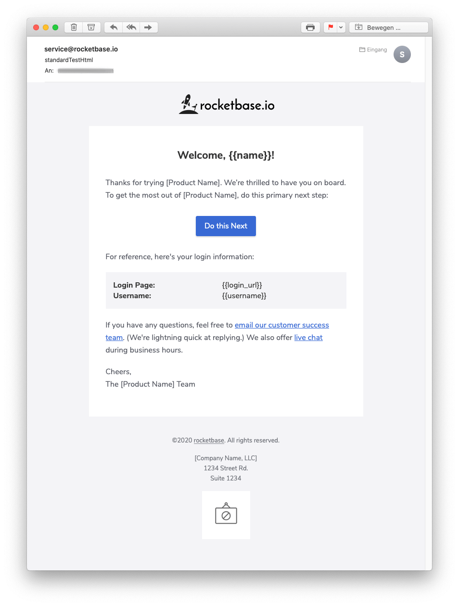
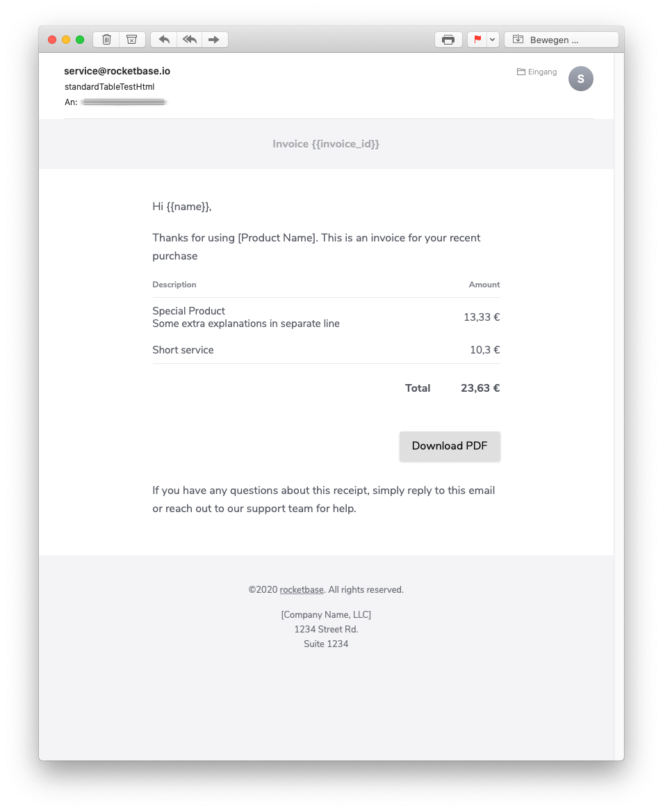
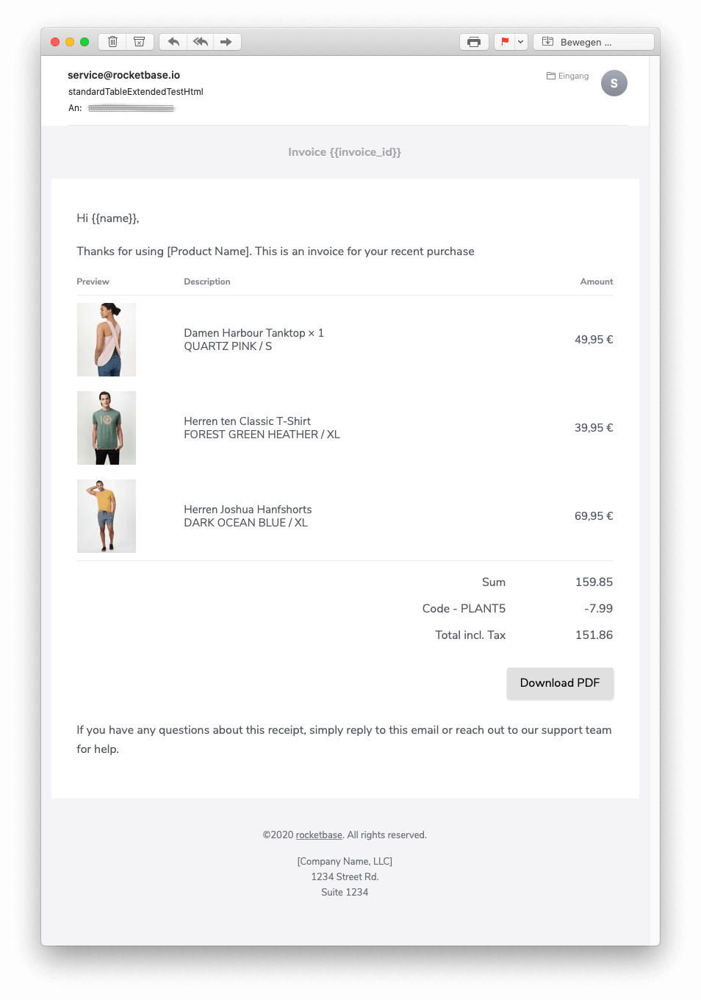

# email-template-builder


[](https://travis-ci.com/rocketbase-io/email-template-builder)
[](https://maven-badges.herokuapp.com/maven-central/io.rocketbase.mail/email-template-builder)

Let this service build your html/text emails in a fluent manner. It doesn't try to reinvent the wheel - it simply extends the given [email-template](https://postmarkapp.com/mailmason) of postmark and backed it for java to use it for many purposes.

You can write your email content fluently and the template builder cares for the correct instyling, conversation to txt version etc...

For sending the email I can recommend the spring-boot-starter-mail, simplejavamail or my [postmark-spring](https://github.com/rocketbase-io/postmark-spring)...

### release notes
- 1.x bases mailgun templates
  - extra dependency on jsoup for auto inlining/transpiling to text
  - doc for old api could be found in wiki
  
- 2.x bases on new postmark templates
  - pom artifact group changed to **io.rocketbase.mail**
  - removed jsoup from dependency and changed api in many cases
  - cleaned up a lot of code
  - separated module in two pices
    - common builder
    - markdown (with markdown support)

## features

- generate html and text mail via one fluent build
- just pebble-template engine as dependency
- support for the following content-types
  - Logo in the header
  - Text also with HTML support and Alignment configuration
  - Image with Alignment configuration and Link options
  - Button with custom Styling
  - Footer with HTML support and Alignment configuration
  - Copyright with dynamic Year and Link options
  - table with header, item/price, total
  - key value pairs
  - interface for tables to provide custom layouts
  - extra module to transpile markdown

## usage

## sample html/text
```java
// generate html/text content
HtmlTextEmail htmlTextEmail = builder
        .header()
        .logo("https://www.rocketbase.io/img/logo-dark.png").logoHeight(41)
        .and()
        .text("Welcome, {{name}}!").h1().center().and()
        .text("Thanks for trying [Product Name]. We’re thrilled to have you on board. To get the most out of [Product Name], do this primary next step:").and()
        .button("Do this Next", "http://localhost").blue().and()
        .text("For reference, here's your login information:").and()
        .attribute()
        .keyValue("Login Page", "{{login_url}}")
        .keyValue("Username", "{{username}}")
        .and()
        .html("If you have any questions, feel free to <a href=\"mailto:{{support_email}}\">email our customer success team</a>. (We're lightning quick at replying.) We also offer <a href=\"{{live_chat_url}}\">live chat</a> during business hours.",
                "If you have any questions, feel free to email our customer success team\n" +
                        "(We're lightning quick at replying.) We also offer live chat during business hours.").and()
        .text("Cheers,\n" +
                "The [Product Name] Team").and()
        .copyright("rocketbase").url("https://www.rocketbase.io").suffix(". All rights reserved.").and()
        .footerText("[Company Name, LLC]\n" +
                "1234 Street Rd.\n" +
                "Suite 1234").and()
        .footerImage("https://cdn.rocketbase.io/assets/loading/no-image.jpg").width(100).linkUrl("https://www.rocketbase.io").and()
        .build();

// sent email
MimeMessage message = emailSender.createMimeMessage();
MimeMessageHelper helper = new MimeMessageHelper(message,
        MimeMessageHelper.MULTIPART_MODE_MIXED_RELATED,
        StandardCharsets.UTF_8.name());
helper.setTo(to);
helper.setSubject(subject);
helper.setText(htmlTextEmail.getText(), htmlTextEmail.getHtml());
helper.setFrom(from);
emailSender.send(message);

```

### preview HTML-Version



### preview Text-Version

```
Welcome, {{name}}!

Thanks for trying [Product Name]. We=E2=80=99re thrilled to have you on boa=
rd. To get the most out of [Product Name], do this primary next step:

Do this Next -> http://localhost

For reference, here's your login information:

Login Page: {{login_url}}
Username: {{username}}


If you have any questions, feel free to email our customer success team
(We're lightning quick at replying.) We also offer live chat during business hours.

Cheers,
The [Product Name] Team
```


### sample table
```java
TbConfiguration config = TbConfiguration.newInstance();
config.getContent().setFull(true);

HtmlTextEmail htmlTextEmail = builder
        .configuration(config)
        .header().text(header).and()
        .text("Hi {{name}},").and()
        .text("Thanks for using [Product Name]. This is an invoice for your recent purchase").and()
        .tableSimple("#.## '€'")
        .headerRow("Description", "Amount")
        .itemRow("Special Product\n" +
                "Some extra explanations in separate line", BigDecimal.valueOf(1333, 2))
        .itemRow("Short service", BigDecimal.valueOf(103, 1))
        .footerRow("Total", BigDecimal.valueOf(2363, 2))
        .and()
        .button("Download PDF", "http://localhost").gray().right().and()
        .text("If you have any questions about this receipt, simply reply to this email or reach out to our support team for help.").and()
        .copyright("rocketbase").url("https://www.rocketbase.io").suffix(". All rights reserved.").and()
        .footerText("[Company Name, LLC]\n" +
                "1234 Street Rd.\n" +
                "Suite 1234").and()
        .build();
```

### preview HTML-Version



### sample table with image

```java
TbConfiguration config = TbConfiguration.newInstance();
config.getContent().setWidth(800);

HtmlTextEmail htmlTextEmail = builder
        .configuration(config)
        .header().text(header).and()
        .text("Hi {{name}},").and()
        .text("Thanks for using [Product Name]. This is an invoice for your recent purchase").and()
        .tableSimpleWithImage("#.## '€'")
        .headerRow("Preview", "Description", "Amount")
        .itemRow("https://cdn.shopify.com/s/files/1/0255/1211/6260/products/TCW1142-07052_small.jpg?v=1589200198", "Damen Harbour Tanktop × 1\n" +
                "QUARTZ PINK / S", BigDecimal.valueOf(4995, 2))
        .itemRow("https://cdn.shopify.com/s/files/1/0255/1211/6260/products/TCM1886-0718_201_fdf0be52-639f-4ea8-9143-6bd75e0821b1_small.jpg?v=1583509609", "Herren ten Classic T-Shirt\n"+
                "FOREST GREEN HEATHER / XL", BigDecimal.valueOf(3995, 2))
        .itemRow("https://cdn.shopify.com/s/files/1/0255/1211/6260/products/TCM1939-0439_1332_da6f3e7c-e18d-4778-be97-c6c0b482b643_small.jpg?v=1583509671", "Herren Joshua Hanfshorts\n" +
                "DARK OCEAN BLUE / XL", BigDecimal.valueOf(6995, 2))
        .footerRow("Sum", BigDecimal.valueOf(15985, 2))
        .footerRow("Code - PLANT5", BigDecimal.valueOf(-799, 2))
        .footerRow("Total incl. Tax\n", BigDecimal.valueOf(15186, 2))
        .and()
        .button("Download PDF", "http://localhost").gray().right().and()
        .text("If you have any questions about this receipt, simply reply to this email or reach out to our support team for help.").and()
        .copyright("rocketbase").url("https://www.rocketbase.io").suffix(". All rights reserved.").and()
        .footerText("[Company Name, LLC]\n" +
                "1234 Street Rd.\n" +
                "Suite 1234").and()
        .build();
```

### preview HTML-Version



A custom table example could be found in [wiki](https://github.com/rocketbase-io/email-template-builder/wiki/Custom-Table).

## testing

```
docker run -d -p 1025:1025 -p 8025:8025 --name mailhog mailhog/mailhog
```