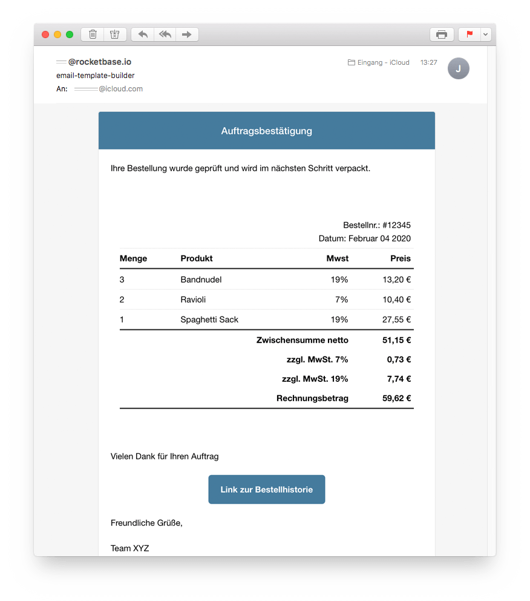

# email-template-builder


[](https://travis-ci.com/rocketbase-io/email-template-builder)
[](https://maven-badges.herokuapp.com/maven-central/io.rocketbase.commons/email-template-builder)

Let this service build your html/text emails in a fluient manner. It doesn't try to reinvent the wheel - it simply extends the given [email-template](https://github.com/mailgun/transactional-email-templates) of mailgun and backed it for java to use it for many purposes.

You can write your email content fluently and the template builder cares for the correct instyling, conversation to txt version etc...

For sending the email I can recommend the spring-boot-starter-mail or simplejavamail...

## features

- generate html and text mail via one fluent build
- just a few dependencies: jsoup + pebble-template engine
- support for the following content-types
  - Logo in the header
  - Header with custom Styling
  - Text also with HTML support and Alignment configuration
  - Image with Alignment configuration and Link options
  - Button with custom Styling
  - Footer with HTML support and Alignment configuration
  - Copyright with dynamic Year and Link options
  - table with header, item/price, total

## usage

## sample html/text
```java
// generate html/text content
HtmlTextEmail htmlTextEmail = EmailTemplateBuilder.builder()
      .logo("https://cdn.rocketbase.io/assets/signature/rocketbase-signature-20179.png", "rocketbase-logo", 250, 50).title("visit rocketbase.io").linkUrl("https://www.rocketbase.io").and()
      .header("Warning: You're approaching your limit").color(new ColorStyle("ffffff", "ff9f00")).and()
      .addText("You have 1 <b>free report</b> remaining.").and()
      .addText("Add your credit card now to upgrade your account to a premium plan to ensure you don't miss out on any reports.").and()
      .addButton("Upgrade My Account", "http//upgrade").color(new ColorStyle("ffffff", "348eda")).center().and()
      .addText("Thanks for choosing Acme Inc.").and()
      .addText("<i>Ps. This email has been build with template-builder</i>").center().and()
      .addImage("https://assets-cdn.github.com/images/modules/logos_page/GitHub-Logo.png", "rocketbase-io/email-template-builder", 250, 65).center().title("link to github project").linkUrl("https://github.com/rocketbase-io/email-template-builder").and()
      .addText("<strong><i>Cheers your rocketbase-team</i></strong>").center().and()
      .addFooter("<a href=\"http://unsubscribe\">Unsubscribe</a> from these alerts.").and()
      .copyright("rocketbase.io").url("https://www.rocketbase.io")
      .build();

// sent email
MimeMessage message = emailSender.createMimeMessage();
MimeMessageHelper helper = new MimeMessageHelper(message,
        MimeMessageHelper.MULTIPART_MODE_MIXED_RELATED,
        StandardCharsets.UTF_8.name());
helper.setTo(to);
helper.setSubject(subject);
helper.setText(htmlTextEmail.getText(), htmlTextEmail.getHtml());
helper.setFrom(from);
emailSender.send(message);

```

### preview HTML-Version


### preview Text-Version

```
Warning: You're approaching your limit
You have 1 free report remaining.
Add your credit card now to upgrade your account to a premium plan to ensure you don't miss out on any reports.
Upgrade My Account -> http//upgrade
Thanks for choosing Acme Inc.
Ps. This email has been build with template-builder

Cheers your rocketbase-team
Unsubscribe -> http://unsubscribe from these alerts.
2018 rocketbase.io -> https://www.rocketbase.io
```


[Email-on-acid-report](https://app.emailonacid.com/app/acidtest/ObQRaQOYKG17yavB6MUHxXXfujAASn6v9iK3JSwFpSteP/list)

### sample table
```java
HtmlTextEmail htmlTextEmail = builder
        .header(header).and()
        .addText("Ihre Bestellung wurde geprüft und wird im nächsten Schritt verpackt.").and()

        .addTable()
        .addHeader("Bestellnr.: #12345<br>Datum: Februar 04 2020", true, Alignment.RIGHT)
        .addItemRowWithPrefixMiddle("Menge", "Produkt", "Mwst", "Preis").headerRow().nextRow()
        .addItemRowWithPrefixMiddle(3, "Bandnudel", "19%", BigDecimal.valueOf(1320, 2)).nextRow()
        .addItemRowWithPrefixMiddle(2, "Ravioli", "7%", BigDecimal.valueOf(1040, 2)).nextRow()
        .addItemRowWithPrefixMiddle(1, "Spaghetti Sack", "19%", BigDecimal.valueOf(2755, 2)).nextRow()
        .addTotalRow(BigDecimal.valueOf(5115, 2)).totalCaption("Zwischensumme netto").borderBottom(false).nextRow()
        .addTotalRow(BigDecimal.valueOf(73, 2)).totalCaption("zzgl. MwSt. 7%").borderTop(false).borderBottom(false).nextRow()
        .addTotalRow(BigDecimal.valueOf(774, 2)).totalCaption("zzgl. MwSt. 19%").borderTop(false).borderBottom(false).nextRow()
        .addTotalRow(BigDecimal.valueOf(5115 + 73 + 774, 2)).totalCaption("Rechnungsbetrag").borderTop(false)

        .and()
        .addText("Vielen Dank für Ihren Auftrag").and()
        .addButton("Link zur Bestellhistorie", "http://adasd").and()
        .addText("Freundliche Grüße,").and()
        .addText("Team XYZ").and()
        .copyright("rocketbase").url("https://www.rocketbase.io")
        .build();
```

### preview HTML-Version

