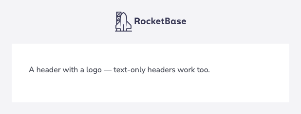
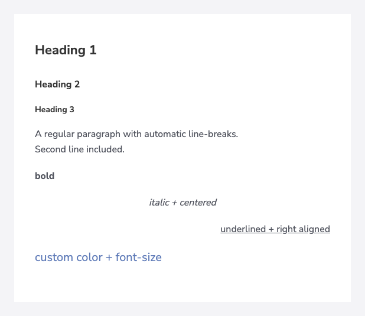
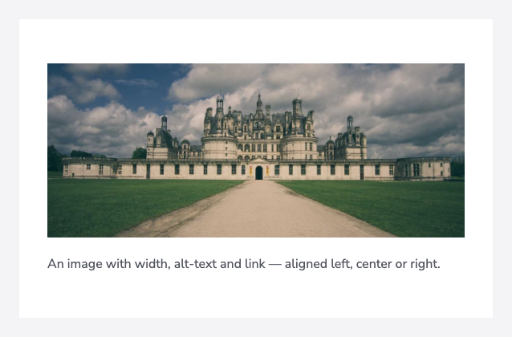
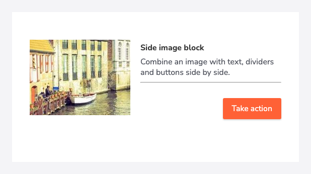
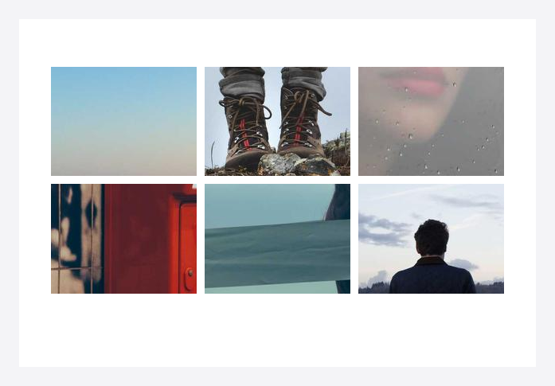
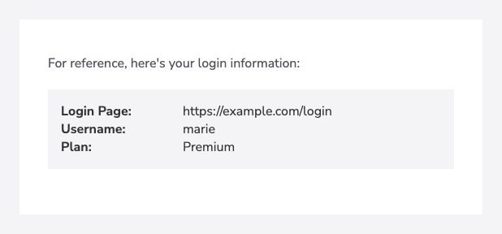
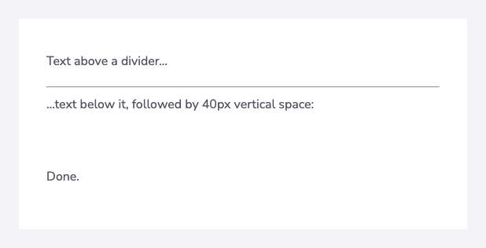
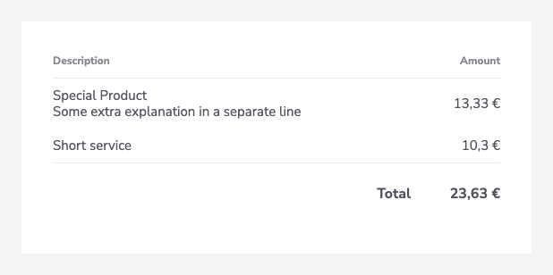
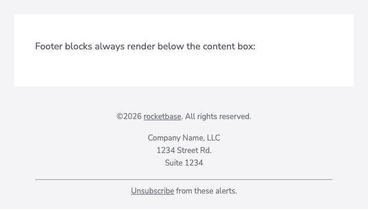

Every email is composed from **lines**. You add a line, configure it fluently and jump back to the
builder with `.and()` — or finish directly with `.build()`:

```java
HtmlTextEmail email = EmailTemplateBuilder.builder()
        .text("Hello").h1().center().and()   // configure line, back to builder
        .button("Action", "https://…").blue().and()
        .build();                            // render html + text
```

Header and footer blocks are kept in place no matter when you add them — everything else appears in
the order it was added.

## Header

A header with a logo (optionally with a dark-mode variant) or a plain text title:

```java
.header()
    .logo("https://example.com/logo.png").logoHeight(41)
    .logoDark("https://example.com/logo-white.png") // used when the client is in dark mode
    .linkUrl("https://example.com")
.and()

// or text-only
.header().text("Invoice #10456").and()
```



## Preheader

The hidden preview text email clients show next to the subject in the inbox list. It is not
rendered in the visible email and not part of the text version:

```java
.preheader("Your order has shipped 🎉")
```

## Text

```java
.text("Welcome, Marie!").h1().center().and()
.text("A regular paragraph.").and()
.text("Styled variants…").bold().italic().underline().color("#5f7bb8").right().and()
```



Options: `h1()` / `h2()` / `h3()`, alignment (`center()`, `right()`), `bold()` / `lighter()`,
`italic()`, `underline()` / `overline()` / `lineThrough()`, `fontSize(…)`, `color(…)` and
`linkUrl(…)` to wrap the text in a link. Line breaks (`\n`) are converted to `<br>` automatically.

## Html

When you need raw markup, provide the HTML and its plain-text counterpart:

```java
.html("If you have any questions, <a href=\"mailto:support@example.com\">email us</a>.",
      "If you have any questions, email us: support@example.com").and()
```

## Button

```java
.button("Do this Next", "https://example.com/next").blue().and()
.button("Download PDF", "https://example.com/invoice.pdf").gray().right().and()
.button("Custom", "https://example.com").color(new ColorStyleSimple("#5f7bb8")).left().and()
```


Presets: `blue()`, `green()`, `red()`, `yellow()`, `black()`, `gray()` — or any custom
text/background combination via `color(new ColorStyleSimple(text, bg))`.

## Image

```java
.image("https://example.com/photo.jpg")
    .width(300)
    .alt("description")
    .linkUrl("https://example.com")
    .srcDark("https://example.com/photo-dark.jpg") // optional dark-mode variant
.and()
```



## Side image

An image next to a small content column — each side block can contain its own texts, dividers and
buttons:

```java
.sideImage("https://example.com/photo.jpg").width(200).linkUrl("https://example.com")
    .imageVerticalAlign(VerticalAlignment.TOP)
    .text("Side image block").h2().and()
    .text("Text shown next to the image.").and()
    .hr().and()
    .button("Take action", "https://example.com").red().right().and()
.and()
```



Use `.right()` to place the image on the right side.

## Gallery

A photo grid with configurable columns — either simple photos or tiles with title and text:

```java
.gallery()
    .newRowAfter(3)
    .cellPadding(5)
    .photos(Arrays.asList(url1, url2, url3, url4, url5, url6))
.and()

// tiles with additional content
.gallery()
    .photo(url1).and()
    .photo(url2)
        .linkUrl("https://example.com")
        .title("tile title")
        .text("Headline").h1().and()
        .text("Some longer text below…").and()
    .and()
.and()
```



## Attributes (key/value)

A compact table for reference data like login details:

```java
.attribute()
    .keyValue("Login Page", "https://example.com/login")
    .keyValue("Username", "marie")
.and()
```



## Divider & spacing

```java
.hr().and()                  // horizontal line
.space().and()               // vertical spacing
.space().height(30).and()    // custom height in px
```



The space line renders reliably in Outlook, too.

## Tables

Invoice-style tables with header, item and footer rows. Number columns take a
`DecimalFormat`-pattern:

```java
.tableSimple("#.## '€'")
    .headerRow("Description", "Amount")
    .itemRow("Special Product\nSome extra explanation", BigDecimal.valueOf(1333, 2))
    .itemRow("Short service", BigDecimal.valueOf(103, 1))
    .footerRow("Total", BigDecimal.valueOf(2363, 2))
.and()
```



Variants:

- `tableSimple(numberFormat)` — description + amount
- `tableSimpleWithImage(numberFormat)` — preview image + description + amount
- `tableFourColumn(taxFormat, amountFormat)` — description, tax, amount and total column

For full control implement the `TableLine` interface and pass it via `.table(customTable)` — you
define column layouts (`ColumnConfig`: width, colspan, alignment, number format, styling) and cell
types (`TableCellImage`, `TableCellLink`, `TableCellHtml`). See the
[custom table example](https://github.com/rocketbase-io/email-template-builder/blob/master/email-template-builder/src/test/java/io/rocketbase/mail/EmailTemplateBuilderTest.java)
in the test sources.

## Footer

Footer blocks always render below the content box:

```java
.copyright("rocketbase").url("https://www.rocketbase.io").suffix(". All rights reserved.").and()
.footerText("Company Name, LLC\n1234 Street Rd.\nSuite 1234").and()
.footerHtml("<a href=\"https://example.com/unsubscribe\">Unsubscribe</a>", "Unsubscribe: https://example.com/unsubscribe").and()
.footerImage("https://example.com/footer.png").width(100).linkUrl("https://example.com").and()
.footerHr().and()
```



`copyright(name)` renders `©<current year> <name>` automatically.
