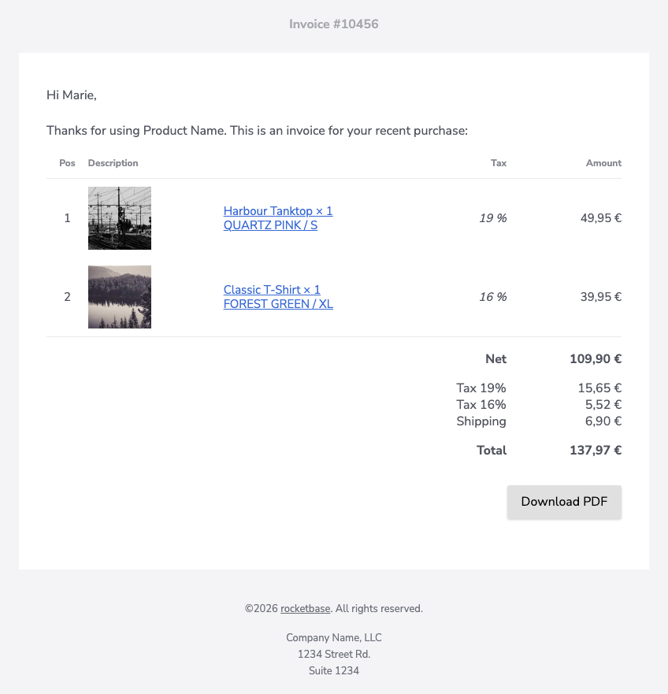

When the built-in presets (`tableSimple`, `tableSimpleWithImage`, `tableFourColumn`) don't fit,
implement the `TableLine` interface yourself. You define the rows and a `ColumnConfig` layout per
row type — width, colspan, alignment, number format and styling — and mix cell types like
`TableCellImage`, `TableCellLink` and `TableCellHtml`.



## Implementing TableLine

```java
@Getter
public static class CustomTable implements TableLine {

    List<List<Object>> headerRows = new ArrayList<>();
    List<List<Object>> itemRows = new ArrayList<>();
    List<List<Object>> footerRows = new ArrayList<>();
    @Getter(AccessLevel.PRIVATE)
    EmailTemplateBuilder.EmailTemplateConfigBuilder builder;
    private AtomicInteger posCounter = new AtomicInteger(1);

    public CustomTable(EmailTemplateBuilder.EmailTemplateConfigBuilder builder) {
        this.builder = builder;
        headerRows.add(Arrays.asList("Pos", "Description", "Tax", "Amount"));
    }

    @Override
    public EmailTemplateBuilder.EmailTemplateConfigBuilder and() {
        return builder;
    }

    @Override
    public HtmlTextEmail build() {
        return builder.build();
    }

    public CustomTable itemRow(TableCellImage image, TableCellLink description, BigDecimal tax, BigDecimal amount) {
        itemRows.add(Arrays.asList(posCounter.getAndIncrement(), image, description, tax, amount));
        return this;
    }

    public CustomTable footerRow(TableCellHtml label, TableCellHtml amount) {
        footerRows.add(Arrays.asList(label, amount));
        return this;
    }

    @Override
    public List<ColumnConfig> getHeader() {
        return Arrays.asList(
                new ColumnConfig().center(),
                new ColumnConfig().colspan(2).width("60%"),
                new ColumnConfig().alignment(Alignment.RIGHT),
                new ColumnConfig().width("20%").alignment(Alignment.RIGHT));
    }

    @Override
    public List<ColumnConfig> getItem() {
        return Arrays.asList(
                new ColumnConfig().center(),
                new ColumnConfig().width(90),
                new ColumnConfig().lighter(),
                new ColumnConfig().numberFormat("# '%'").italic().right(),
                new ColumnConfig().numberFormat("#,##0.00 '€'").right());
    }

    @Override
    public List<ColumnConfig> getFooter() {
        return Arrays.asList(
                new ColumnConfig().colspan(4).alignment(Alignment.RIGHT),
                new ColumnConfig().alignment(Alignment.RIGHT));
    }
}
```

## Usage

Pass your table to the builder via `.table(…)`:

```java
TbConfiguration config = TbConfiguration.newInstance();
config.getContent().setWidth(800);

EmailTemplateBuilder.EmailTemplateConfigBuilder builder = EmailTemplateBuilder.builder()
        .configuration(config)
        .header().text("Invoice #10456").and()
        .text("Hi Marie,").and()
        .text("Thanks for using Product Name. This is an invoice for your recent purchase:").and();

CustomTable customTable = new CustomTable(builder);
customTable.itemRow(new TableCellImageSimple("https://picsum.photos/seed/tanktop/160/160").width(80),
        new TableCellLinkSimple("Harbour Tanktop × 1\nQUARTZ PINK / S", "https://example.com/?item=1234"),
        BigDecimal.valueOf(19),
        BigDecimal.valueOf(4995, 2));
customTable.itemRow(new TableCellImageSimple("https://picsum.photos/seed/tshirt/160/160").width(80),
        new TableCellLinkSimple("Classic T-Shirt × 1\nFOREST GREEN / XL", "https://example.com/?item=4567"),
        BigDecimal.valueOf(16),
        BigDecimal.valueOf(3995, 2));
customTable.footerRow(new TableCellHtmlSimple("<b>Net</b>", "Net"),
        new TableCellHtmlSimple("<b>109,90 €</b>", "109,90 €"));
customTable.footerRow(new TableCellHtmlSimple("Tax 19%<br>Tax 16%<br>Shipping", "Tax 19%\nTax 16%\nShipping"),
        new TableCellHtmlSimple("15,65 €<br>5,52 €<br>6,90 €", "15,65 €\n5,52 €\n6,90 €"));
customTable.footerRow(new TableCellHtmlSimple("<b>Total</b>", "Total"),
        new TableCellHtmlSimple("<b>137,97 €</b>", "137,97 €"));

HtmlTextEmail email = builder.table(customTable)
        .button("Download PDF", "https://example.com/invoice.pdf").gray().right().and()
        .copyright("rocketbase").url("https://www.rocketbase.io").suffix(". All rights reserved.").and()
        .footerText("Company Name, LLC\n1234 Street Rd.\nSuite 1234").and()
        .build();
```

## Cell types

| Type | Simple implementation | Purpose |
| ----------------- | ---------------------- | ---------------------------------------- |
| `TableCellImage` | `TableCellImageSimple` | image cell with optional `width(…)` |
| `TableCellLink` | `TableCellLinkSimple` | text wrapped in a link |
| `TableCellHtml` | `TableCellHtmlSimple` | raw HTML with a plain-text counterpart |

Plain values (`String`, numbers, `BigDecimal`) work directly — number columns apply the
`numberFormat` of their `ColumnConfig`.
