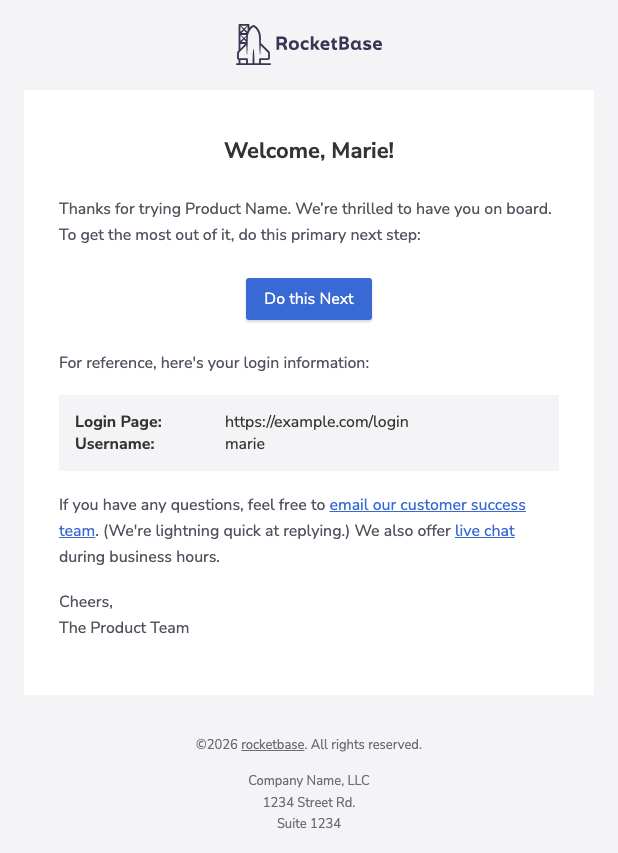
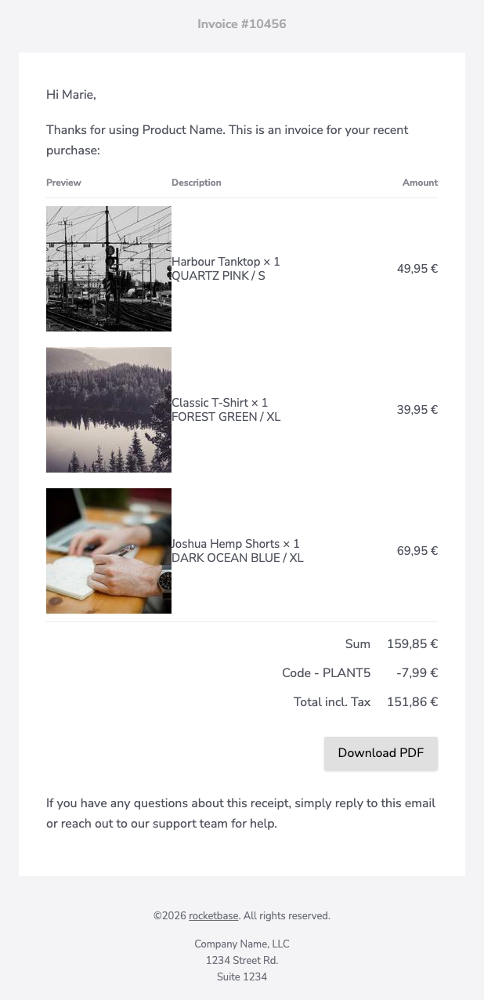
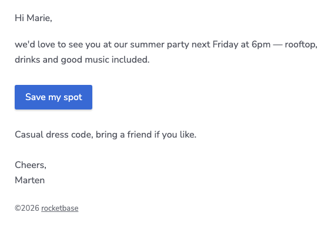
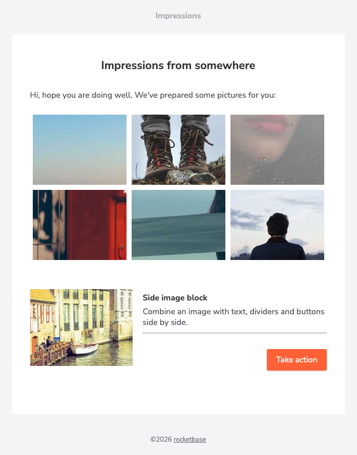
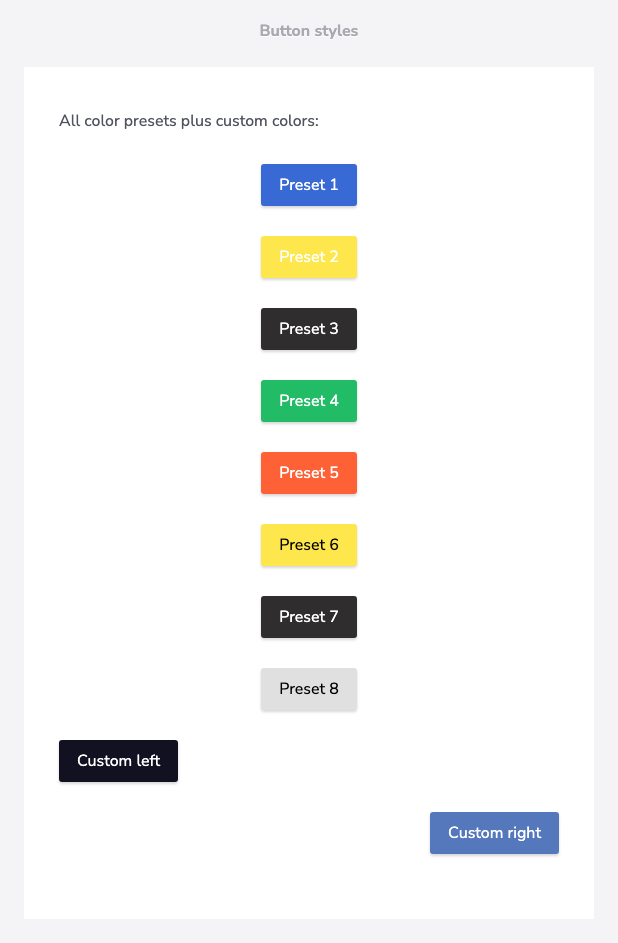

import { Image } from 'astro:assets';
import welcomeMobile from '../../assets/screenshots/welcome-mobile.png';

All examples on this page are generated by
[`DocsSamplesTest`](https://github.com/rocketbase-io/blob/master/src/test/java/io/rocketbase/mail/DocsSamplesTest.java)
in the repository — the code shown here is exactly what produced the screenshots.

## Welcome email

The classic onboarding email: logo header, headline, call-to-action button, login details as
key/value block and a footer.



```java
HtmlTextEmail email = EmailTemplateBuilder.builder()
        .header()
        .logo("https://cdn.jsdelivr.net/gh/rocketbase-io/email-template-builder@master/assets/line-version-nightblue.svg")
        .logoDark("https://cdn.jsdelivr.net/gh/rocketbase-io/email-template-builder@master/assets/line-version-white.svg")
        .logoHeight(41)
        .and()
        .text("Welcome, Marie!").h1().center().and()
        .text("Thanks for trying Product Name. We’re thrilled to have you on board. To get the most out of it, do this primary next step:").and()
        .button("Do this Next", "https://example.com/next").blue().and()
        .text("For reference, here's your login information:").and()
        .attribute()
        .keyValue("Login Page", "https://example.com/login")
        .keyValue("Username", "marie")
        .and()
        .html("If you have any questions, feel free to <a href=\"mailto:support@example.com\">email our customer success team</a>.",
                "If you have any questions, feel free to email our customer success team.").and()
        .text("Cheers,\nThe Product Team").and()
        .copyright("rocketbase").url("https://www.rocketbase.io").suffix(". All rights reserved.").and()
        .footerText("Company Name, LLC\n1234 Street Rd.\nSuite 1234").and()
        .build();
```

## Invoice with product images

`tableSimpleWithImage` renders an invoice table with preview images, item descriptions and
formatted amounts — footer rows for sums and discounts included.



```java
HtmlTextEmail email = EmailTemplateBuilder.builder()
        .header().text("Invoice #10456").and()
        .text("Hi Marie,").and()
        .text("Thanks for using Product Name. This is an invoice for your recent purchase:").and()
        .tableSimpleWithImage("#.## '€'")
        .headerRow("Preview", "Description", "Amount")
        .itemRow("https://picsum.photos/seed/tanktop/160/160", "Harbour Tanktop × 1\nQUARTZ PINK / S", BigDecimal.valueOf(4995, 2))
        .itemRow("https://picsum.photos/seed/tshirt/160/160", "Classic T-Shirt × 1\nFOREST GREEN / XL", BigDecimal.valueOf(3995, 2))
        .itemRow("https://picsum.photos/seed/shorts/160/160", "Joshua Hemp Shorts × 1\nDARK OCEAN BLUE / XL", BigDecimal.valueOf(6995, 2))
        .footerRow("Sum", BigDecimal.valueOf(15985, 2))
        .footerRow("Code - PLANT5", BigDecimal.valueOf(-799, 2))
        .footerRow("Total incl. Tax", BigDecimal.valueOf(15186, 2))
        .and()
        .button("Download PDF", "https://example.com/invoice.pdf").gray().right().and()
        .text("If you have any questions about this receipt, simply reply to this email or reach out to our support team for help.").and()
        .copyright("rocketbase").url("https://www.rocketbase.io").suffix(". All rights reserved.").and()
        .footerText("Company Name, LLC\n1234 Street Rd.\nSuite 1234").and()
        .build();
```

Need a fully custom column layout? See the [custom table guide](/custom-table/).

## Frameless invitation

`TbConfiguration.newInstanceFrameless()` removes the box-frame — the email looks personally
written. Combined with a `preheader` for the inbox preview text:



```java
TbConfiguration config = TbConfiguration.newInstanceFrameless();

HtmlTextEmail email = EmailTemplateBuilder.builder()
        .configuration(config)
        .preheader("You are invited to our summer party 🎉")
        .text("Hi Marie,").and()
        .text("we'd love to see you at our summer party next Friday at 6pm — rooftop, drinks and good music included.").and()
        .button("Save my spot", "https://example.com/rsvp").blue().left().and()
        .text("Casual dress code, bring a friend if you like.\n\nCheers,\nMarten").and()
        .copyright("rocketbase").url("https://www.rocketbase.io").and()
        .build();
```

## Gallery & side image

Photo grids with configurable columns plus an image-beside-content block:



```java
HtmlTextEmail email = EmailTemplateBuilder.builder()
        .header().text("Impressions").and()
        .text("Impressions from somewhere").h1().center().and()
        .text("Hi, hope you are doing well. We've prepared some pictures for you:").and()
        .gallery()
        .newRowAfter(3)
        .cellPadding(5)
        .photos(Arrays.asList(url1, url2, url3, url4, url5, url6))
        .and()
        .sideImage("https://picsum.photos/seed/side/500/375").width(200).linkUrl("https://www.rocketbase.io")
        .imageVerticalAlign(VerticalAlignment.TOP)
        .text("Side image block").h2().and()
        .text("Combine an image with text, dividers and buttons side by side.").and()
        .hr().and()
        .button("Take action", "https://example.com").red().right().and()
        .and()
        .copyright("rocketbase").url("https://www.rocketbase.io").and()
        .build();
```

## Button styles

All color presets plus custom colors and alignments:



```java
EmailTemplateBuilder.EmailTemplateConfigBuilder builder = EmailTemplateBuilder.builder()
        .header().text("Button styles").and()
        .text("All color presets plus custom colors:").and();

int step = 1;
for (ColorStyle s : ColorStyleSimple.getAllPresets()) {
    builder.button("Preset " + step++, "https://example.com").color(s).center();
}
builder.button("Custom left", "https://example.com").color(new ColorStyleSimple("#1c1c28")).left();
builder.button("Custom right", "https://example.com").color(new ColorStyleSimple("#5f7bb8")).right();

HtmlTextEmail email = builder.build();
```

## Responsive out of the box

The same welcome email below 600px viewport width — the layout collapses to full width
automatically:

<Image src={welcomeMobile} alt="Mobile rendering of the welcome email" style="max-width: 320px; height: auto;" />
